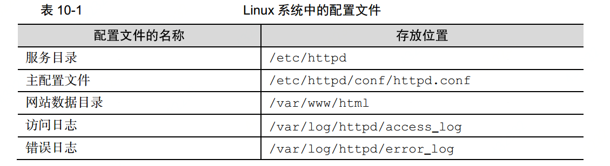
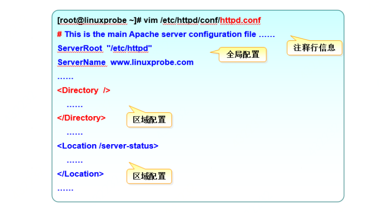
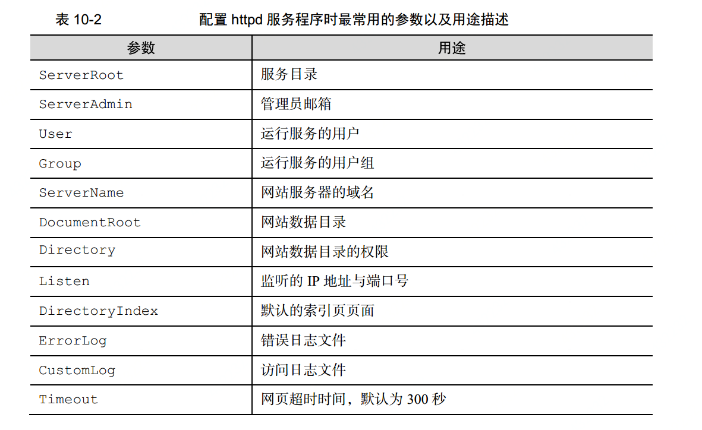

# apache
  apache跟nginx是差不多的，是静态资源服务器，一般用于处理静态资源。
## 安装
  从yum上进行安装使用`yum install httpd`命令

  安装后默认是不启用的，我们需要使用systemcli 把服务启用并且放到重启自启动中

## httpd配置文件

 

## httpd主配置文件
  配置文件组成类型

  

  配置文件主要属性

   
