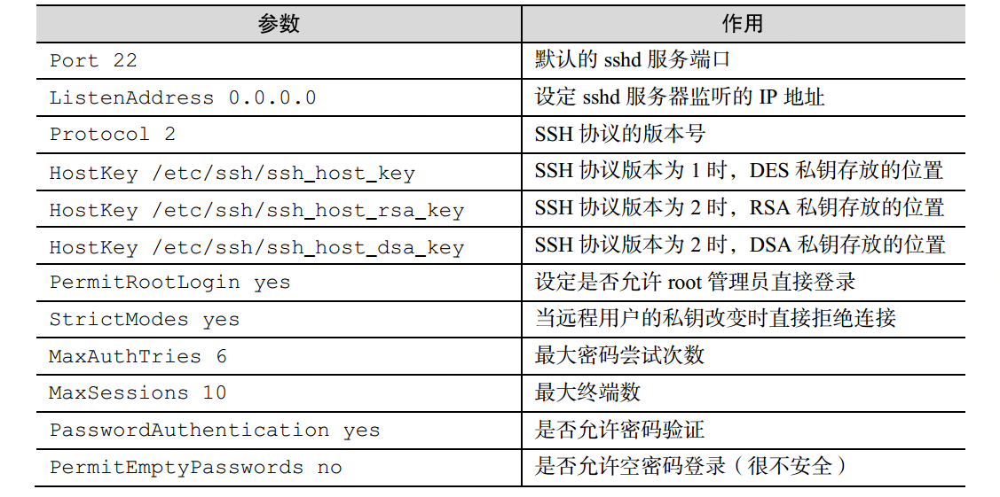

# ssh
  ssh是一种以安全的方式远程登录的一种协议。
  linux中ssh的管理服务是sshd服务，centos7中自带的。
## 验证方式
  ssh安全验证登录主要有两种。
1. 口令密码验证：也就是登录的时候需要输入用户名和密码，这种安全性并不高，因为linux一切皆文件，我们的密码也是存到一个文件中，这样黑客就可以通过破解文件来获取密码。
2. 基于秘钥的验证：这种是安全性比较高的，首先在本地生成密钥对，然后把密钥中的公钥上传到服务器，并与服务器中的公钥比对，所以相对安全一点儿。

## 修改配置
  一切皆文件，ssh的配置文件在`/etc/ssh/sshd_config`文件中，按照键值对的形式进行配置，如果不想用某个配置或者想让某个配置生效那么就在相应的配置属性前加`#`或者去掉。
  下面是一些基本的配置属性

  

## 远程登录命令
  使用`ssh[参数] ip`进行远程登录。

  还需要了解的就是我们修改完配置文件后不会立即生效。我们需要把sshd服务重启。

  重启服务需要使用`systemctl restart sshd`命令

  如果把服务设置到开机自启动的话就使用`systemctl enable sshd`命令

## 安全密钥验证
  通过一定的算法(密钥)把明文加密成密文。这个密钥就是从密文中获取真正数据的钥匙。密钥有公钥和私钥之分。
  我们如果害怕公钥的传输过程中被窃取，那么我们可以在传输前对公钥进行加密。那么只有拥有私钥的人才能获取到真正的明文。
  而且这个很难破解出来。

  如何配置ssh安全密钥验证

  1. 在客户端生成密钥对
    我们首先需要在客户端生成密钥对使用`ssh-keygen`生成密钥
  2. 把公钥传到服务器上
    `ssh-copy-id 192.168.10.10`
  3. 修改服务sshd配置禁止口令登录
  4. 使用ssh命令登录服务器

