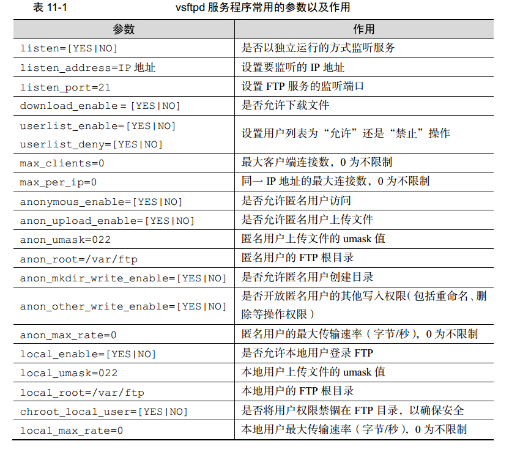
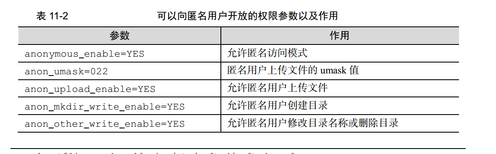
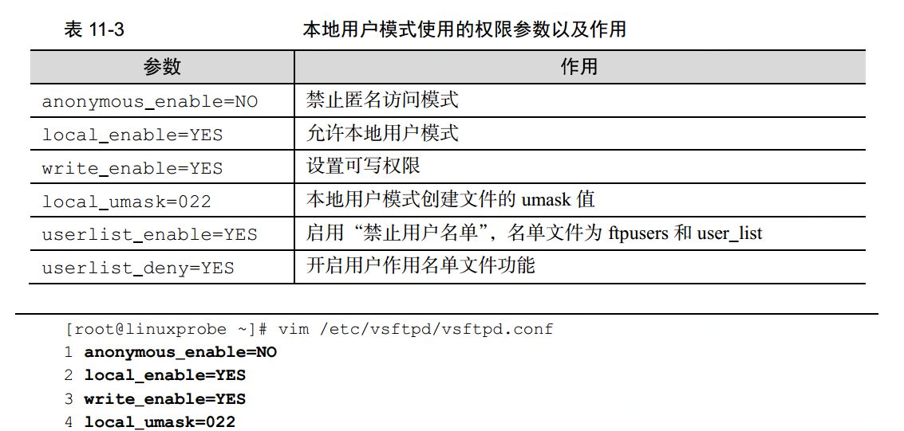

# ftp
  ftp是一种在互联网中文件传输的协议。基于服务端/客户端的形式。默认使用20、21端口。

  20端口主要进行数据传输。

  21端口主要接受客户端发来的ftp的相关命令和参数。

## 工作模式
  1. 主动模式：服务器端主动向客户端发送连接请求。
  2. 被动模式：客户端向服务器端发送连接请求。(默认工作模式)

  正是因为一般ftp都是使用被动模式，但是服务器一般都是有防火墙的，对外来流量进行限制，所以我们如果想要使用的话就把工作模式改为主动模式就可以了。

## 主要参数

## 模式
 1. 匿名开放模式：所有人都可以登录服务端没有任何验证
 2. 本地用户登录：通过本地用户的账号和密码登录
 3. 虚拟用户模式：安全性最高，ftp单独创建虚拟用户数据库，与本地用户没有关系，
 专门为ftp所用，即使黑客盗取了本地用户信息也登录不了ftp服务器。不过配置比较复杂。

## 匿名开放模式
  需要放开一些设置属性

  

### 匿名登录
  使用 `ftp [ip]`的形式去登录ftp，如果使用匿名的话登录名是anonymous，密码输入的时候回车直接跳过。

  一般ftp的默认路径是`/var/ftp` 我们可以进入pub目录下 我们在创建个目录发现权限不足，因为默认这个目录是只有管理员有权限修改，所以我们还需要把这个目录的所有者改为ftp

## 本地用户模式
  开放属性

  

### 本地用户登录
  使用本地用户登录跟匿名登录相同只是在用户名输入的时候使用用户名登录。当我们使用root登录时发现被拒绝。

  这是因为ftp有个两个名单 在这个名单下的将禁止登录ftp，这可以防止root被窃取后保证ftp数据的安全。
  我们可以把`ftpusers 和 user_list `这两个名单下的root给删除掉。

  登录的默认目录就是用户的家目录