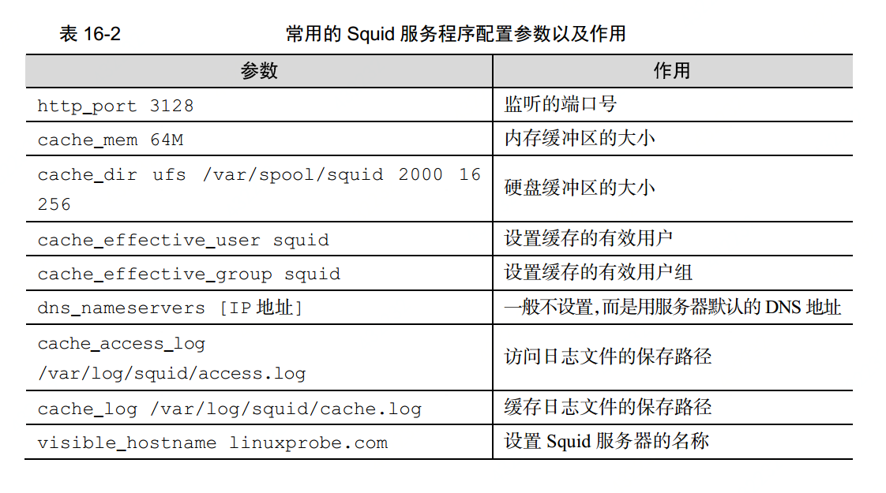
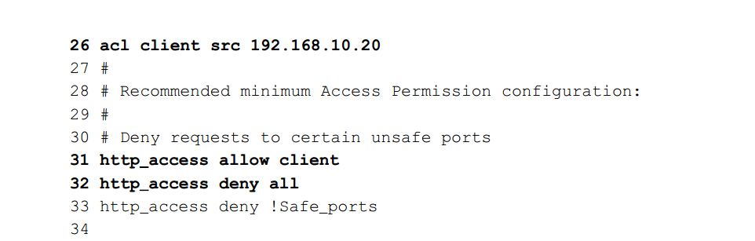

# 代理缓存
 把用户请求网站服务的页面数据或者图片等等的数据缓存到服务器上，可能缓存到了内存或者磁盘上，当用户发送同样的请求的时候
 把缓存起来的数据返回给用户，这样可以减少网站服务器的压力，并且有更快的响应。不过缓存的数据大多都是静态数据，不会怎么改变的。
## 代理方式
1. 正向代理：

  是指用户通过代理服务程序去获取其他网站的数据，以及可以使用基于访问控制列表(ACL)对用户访问网站的行为进行限制。

  正向代理又分为标准代理模式和透明代理模式。

  a. 标准正向代理

   把用户访问的网站数据缓存到本地服务器也就是代理服务器上，以提高用户再次访问网站的效率，但是用户必须在浏览器上显式的去配置代理服务器的ip和端口，否则默认不开启。

  b. 透明正向代理

   用户不需要主动的去配置代理服务的ip和端口，一切对用户是透明的。

  正向代理一般用于企业内部，来当企业内部员工访问外网的一个网关。对员工上网进行限制或者做一些审计。

2. 反向代理

  反向代理指的是让多个节点的网站服务器反向缓存网站数据。也就是把用户请求这些服务器数据时，由代理程序处理，
  把一些静态数据返回给用户，降低服务器压力。
  比如像cdn服务，就是利用的反向代理，把代理服务器放在不同的地方，让用户就近访问到缓存的静态数据。加快响应速度。


## squid代理程序配置
  主要参数

  

### 正向代理配置
  正向代理可以使用默认的配置就可以，不过万一有人蹭网怎么办呢，我们这目前是公开的
  而且还没有密码验证。

  我们可以使用一下别的端口，squid默认配置的端口3128、 3401 与 4827，所以我们可以把默认端口改成别的值，能简单的进行保护。

### ACL访问控制
  比如防止企业员工玩儿游戏，或者登录敌对网站等等。可以使用acl进行控制，配置一些策略。

  

1. 只允许某个ip可以访问

  ```
  acl client src 192.168.10.20
  http_access allow client
  http_access deny all
  ```

  这个的意思就是起一个别名叫client 然后他的ip是192.168.10.20
  我们只允许client访问，其他的全部都禁止。

2. 禁止访问含有关键词为linux的网站
   ```
   acl deny_keyword url_regex -i linux
   http_access deny deny_keyword
   ```
3. 禁止访问特定网站
 ```
 acl deny_url url_regex -i linux
 http_access deny deny_url
 ```

### 透明正向代理
  透明正向代理就是依靠dhcp服务器，动态分配ip给客户机然后客户机就不需要配置任何代理配置就可以使用代理上网。

### 反向代理
  反向代理需要注意的是有的钓鱼网站可能反向代理别人的域名，以这样的方式去骗的用户信任，所以一般的网站停止了反向代理，而是开启CDN内容分发网络。