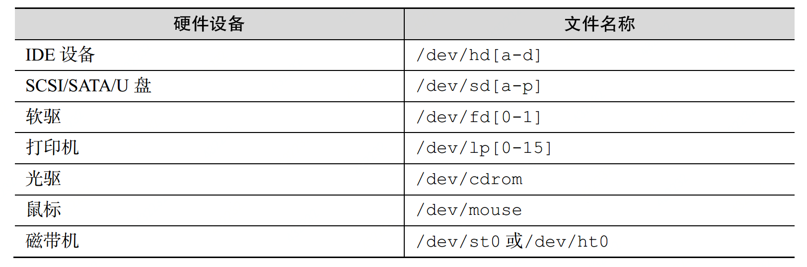
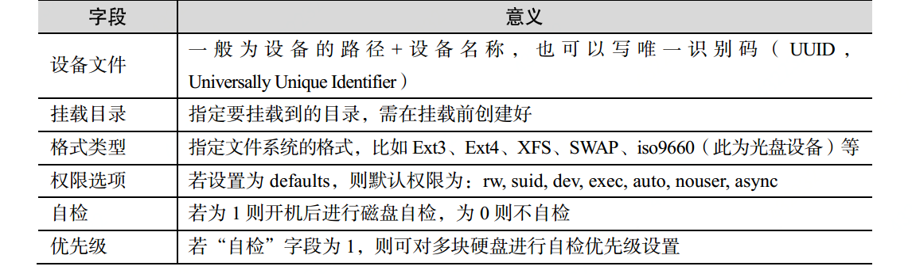
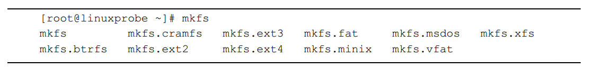

# 文件系统
## 一切从"/"开始
  linux一切皆为文件，比如目录，打印机设备，套接字都是文件，那么他们肯定会在硬盘上有一个地方存放这些文件，
  比如我们使用windows系统可能有c盘d盘，但是linux都是从`/`开始，并按照文件系统层次化标准（FHS， Filesystem Hierarchy Standard）来划分区域。
  并且文件和目录严格遵循大小写。
## 常见目录以及介绍

## 硬件设备文件
  硬件设备文件也是通过一定的规则去指定的，比如我们可以通过他的命名方式可以推测出是什么设备。

## 设备文件信息
  比如我们的硬盘或者usb口，他是有很多个的，如果要对这些进行辨别需要定义不同的命名方式。

  `/dev/sda5`

  1. sd 表示存储设备
  2. a表示是第一个被识别到的设备
  3. 5表示是第5个逻辑分区

## 挂载
  如果我们需要使用一个新的设备中的数据或者使用分区的数据，我们需要把一个目录与分区或设备做一个关联，这个操作叫做挂载。

### 命令格式
 `mount 文件系统 挂载目录`
### 参数
  1. -a: 挂载所有在/etc/fstab 中定义的文件系统
  2. -t: 指定文件系统的类型
### 记录到/etc/fstab文件中
  我们如果用了挂载命令去挂载一个新的硬盘，那么在重启之后挂载信息就解除了，如果我们想一直保留这个挂载信息。
  那么我们应该按照一定的规则把挂载信息写到/etc/fstab中。

  规则 `设备文件 挂载目录 格式类型 权限选项 自检 优先级`

  

  如果我们需要使用uuid进行挂载 那么我们需要使用`blkid /dev/sdc1`命令先去获取磁盘的uuid

## 卸载
 如果我们不再需要某个硬件的资源了，我们就可以使用umount命令去卸载文件。
### 命令
`umount [挂载点/设备文件]`

## 分区
### fdisk命令
  `fdisk 磁盘名称`

  它集成了添加、删除、转换分区的功能。
### 分区参数

  这种参数并不是直接带在命令上的，他是进入一个模式，然后通过交互的方式去管理磁盘的分区。

## 格式化
  正常我们建立了分区了，需要格式化成特殊的格式我们才能往这个分区中写入数据。
### 命令
  mkfs

 这个命令有一对的子命令，用于格式化不同类型的存储格式，使用也非常简单。就使用命令`mkfs.xfs /dev/sda`就可以了。

`df -h`可以看到机器的所有挂载信息和硬盘使用量信息。

## swap分区
  swap是充当内存的一个补充，可以把内存中不常用的数据转移到这里，但其实它是硬盘的分区。

  使用`mkswap /dev/sdb2`命令对硬盘进行swap分区格式化然后使用`swapon`命令正式挂载。

  使用`free -m `命令查看swap分区的变化。

## 查看磁盘容量等等 df
## 查看文件大小 du
