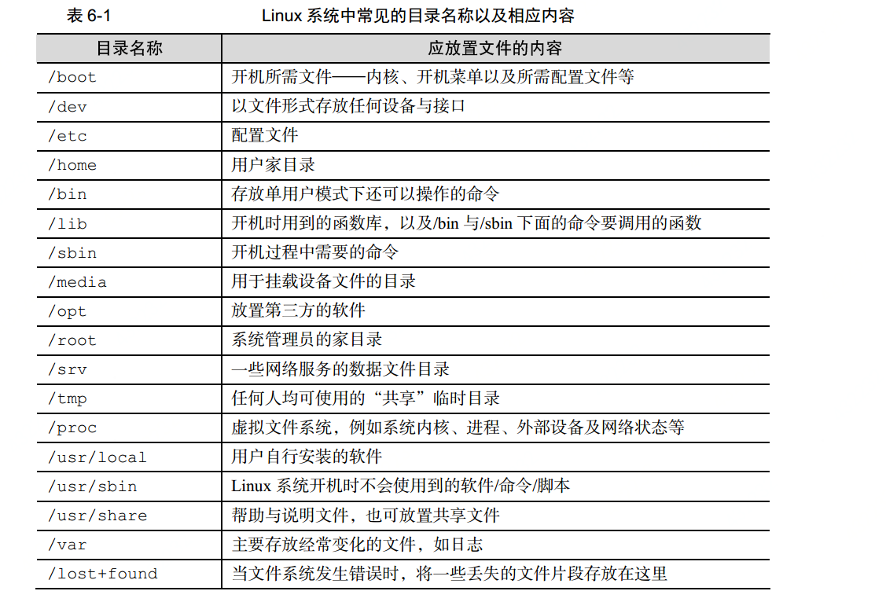

# 文件系统
## 一切从"/"开始
  linux一切皆为文件，比如目录，打印机设备，套接字都是文件，那么他们肯定会在硬盘上有一个地方存放这些文件，
  比如我们使用windows系统可能有c盘d盘，但是linux都是从`/`开始，并按照文件系统层次化标准（FHS， Filesystem Hierarchy Standard）来划分区域。
  并且文件和目录严格遵循大小写。
## 常见目录以及介绍
