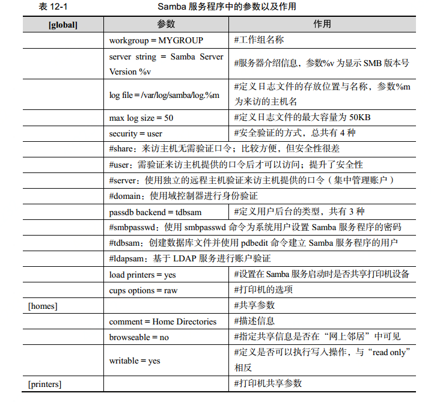
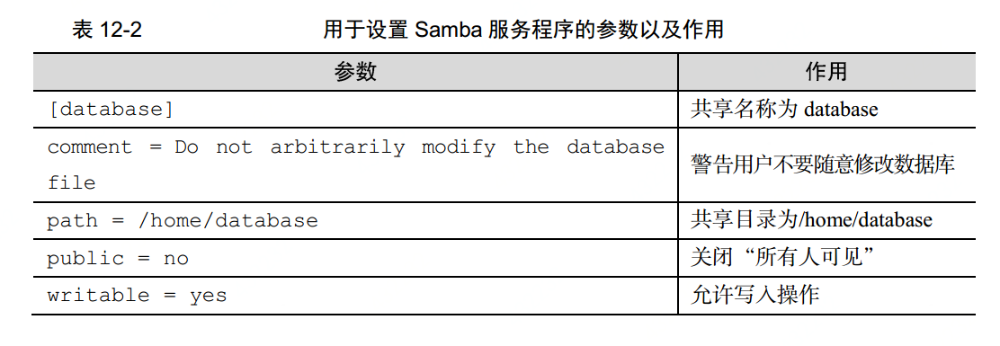

# samba文件共享服务
  微软与因特尔共同制定了SMB协议，旨在解决局域网内的文件或者打印机等资源的共享问题。

  samba是基于这个协议开发的共享服务程序，目前是windows与linux共享文件的最佳选择。

## 安装
  需要使用yum安装 `yum install samba`

## 主要参数

 

## 配置共享资源
 1. 需要配置一些参数才能使用共享资源

 

 配置完成重启服务即可。即可把共享资源的环境搭建好。

 2. 创建用户数据库
 因为samba使用的口令验证，通过用户名密码访问，但是得需要建立一个用户数据库，才能使用口令登录。

 pdbedit命令用于管理smb服务程序的账户信息数据库

 格式为`pdbedit [参数] 账户`

 具体参数为

 

 使用命令`pdbedit -a -u [用户名]` 创建用户数据

 3. 创建共享文件目录
 创建目录的时候需要考虑目录的权限，把权限都设置好，
 目录的创建与配置中的设置一样。

 4. 与windows共享文件目录
 windows在资源管理器上直接输入ip打上用户名密码即可进入共享目录并且还有家目录

 5. 与linux系统共享文件目录

   1. 首先需要安装cifs-utils这个工具
   2. 需要写一个认证文件 并修改权限

            [root@linuxprobe ~]# vim auth.smb
            username=smbuser
            password=redhat
            domain=MYGROUP
            [root@linuxprobe ~]# chmod 600 auth.smb

   3. 挂载一个目录为共享目录

        //192.168.10.10/database /database cifs credentials=/root/auth.smb 0 0

   4. 挂载成功后就可以看到共享目录中的文件或者修改文件之类的了

# nfs
  nfs也是文件共享 不过他是linux系统之间的文件共享，不像samba配置的那么复杂。

## 安装
  他需要安装一个nfs软件包，可以通过yum来安装`yum install nfs-utils`
## 配置
 1. 需要两台linux
 2. 创建共享文件夹
 3. 在/etc/exports文件中设置一些参数规则
 4. 启动启用服务
 5. 挂载目录

# autofs 自动挂载服务
  他实现了当用户去访问一个还没有被挂载的文件系统的时候，那么这个服务将自动挂载这个文件系统。

## 安装
  使用yum命令进行安装`yum install autofs`

