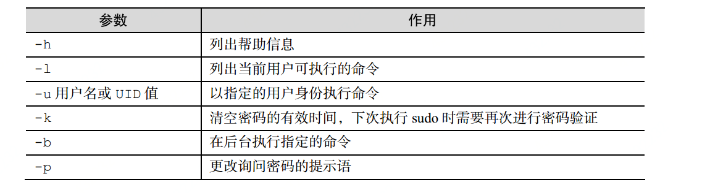

# 用户身份
## 用户身份类型
1. 管理员 UID为0
2. 系统用户 UID 从1~999
3. 普通用户 UID 1000以后
## 用户组
 用户组方便管理员统一进行授权或者指定任务。
# 文件权限与归属
## 文件类型符号
1. -：普通文件
2. d：目录文件
3. l：链接文件
4. b：块设备文件
5. c: 字符设备文件
6. p：管道文件
## 文件的权限
r: 可读 可以用4表示
w: 可写 可以用2表示
x: 可执行 可以用1表示

如果我们表示一个文件的权限一般可以rwxrw-r--来表示，三个为一组
分别代表，文件所有者，文件所属组，其他用户，我们所说的764其实可以表示为
(4+2+1)(4+2)(4)等同于上面的例子。

## 文件权限设置命令chmod

1. 设置文件目录权限   格式`chmod [参数] 权限 文件` 权限就可以使用760这种简便的写法
2. 设置文件目录所属组或者用户和名称  格式`chown [参数] 所有者:所属组 文件或目录名称`

**针对目录操作时需要使用-R参数递归对目录的所有文件执行操作**

3. 设置文件或者目录的特殊权限

   1. SGID权限：让执行者临时拥有组的权限 chmod -Rf g+s testdir/
   2. SUID权限： 让执行者临时拥有属主的权限
   3. SBIT权限： 让文件或者目录的所有者才能进行删除 就算是777的权限也不行 chmod -R o+t linux/

## 文件的隐藏权限

### 设置文件的隐藏的权限
  `chattr [参数] 文件` 通过这个命令设置文件的隐藏的权限，具体的权限是通过参数+[权限代表符号 ]来增加 通过-来去掉权限。

  1. i : 无法对文件进行修改；若对目录设置了该参数，则仅能修改其中的子文件内容
         而不能新建或删除文件
  2. a: 仅允许补充（追加）内容，无法覆盖/删除内容（Append Only）
  3. S: 文件内容在变更后立即同步到硬盘（sync）
  4. s: 彻底从硬盘中删除，不可恢复（用 0 填充原文件所在硬盘区域）
  5. A: 不再修改这个文件或目录的最后访问时间（atime）
  6. b: 不再修改这个文件或目录的最后访问时间（atime）
  7. D: 检查压缩文件中的错误
  8. d: 使用 dump 命令备份时忽略本文件/目录
  9. c: 默认将文件或目录进行压缩
  10. u: 当删除该文件后依然保留其在硬盘中的数据，方便日后恢复
  11. t: 让文件系统支持尾部合并（tail-merging）
  12. X: 可以直接访问压缩文件中的内容
### 查询文件的隐藏权限
  使用`lsattr `来查看文件的隐藏权限

## acl文件访问控制
   如果需要对某个用户进行单独的权限控制，那么就需要acl文件访问控制了

# 用户权限
## 切换用户 su
  su命令可以切换用户 比如从root切换为普通用户，从普通用户切换为root
  `su - shp` 中间的短横线建议加上 这个代表完全切换 连环境变量都一起切换为用户设置的
## sudo
   把特定命令的执行权限赋给指定用户

   

