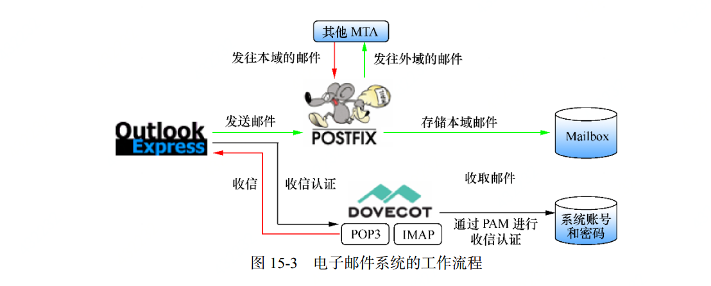

# 邮件系统
## 传输协议
1. 简单邮件传输协议(SMTP):用于发送和中转发送的电子邮件，占用25端口 tcp
2. 邮局协议版本3(Post Office Protocol 3) POP3：用于将电子邮件存储到本地，占用110/tcp端口
3. Internet消息访问协议版本4 IMAP4：用于本地主机访问电子邮件，占用143/tcp端口。
## 邮件系统角色
1. MUA（邮件用户代理）：为用户收发电子邮件
2. MDA（邮件投递代理）：保存用户邮件"信箱"的服务器。它的职责就是把从MTA来的电子邮件存储到本地的收件箱中。
3. MTA（邮件传输代理）：转发处理不同邮件服务供应商之间的邮件。找到从MUA来的邮件转发到合适的MTA上。
## 部署邮件系统
1. Postfix程序：基于SMTP提供发送邮件功能。
2. Dovecot程序：提供收件功能。

## 邮件别名系统
  通过配置linux系统中/etc/aliases文件，可以配置一些本地用户或者虚拟用户，这些用户可以接收邮件，但其实接收邮件的并不是这个用户，可能是别的用户，
  这我们就要小心那些可能冒充客服的邮件了，以免上当受骗被黑。