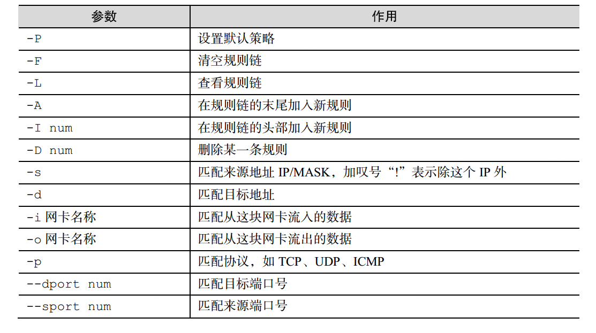

# 防火墙iptables和firewalld
  1. iptables是早期linux使用的防火墙的管理工具
  2. firewalld是centos7(红帽7)的新兴产品也是防火墙的管理工具

  其实都是对防火墙的一些策略进行管理，只要学会一种就可以。

# 防火墙
  防火墙其实就是建立了一些规则，这些规则对于进入机器的流量或者出机器的流量进行限制。

## iptables拦截类型
 1. 在进行路由选择前处理数据包（PREROUTING）
 2. 处理流入的数据包（INPUT）
 3. 处理流出的数据包（OUTPUT）
 4. 处理转发的数据包（FORWARD）
 5. 在进行路由选择后处理数据包（POSTROUTING）

 其实我们输出流量是可控的比较良性的，输入流量是黑客入侵的主要方式。

## iptables拦截处理
 1. ACCEPT 允许流量通过
 2. REJECT 拒绝流量通过
 3. LOG 记录日志
 4. DROP 拒绝流量通过

 REJECT与DROP的区别就是REJECT是拒绝流量是给发送方返回一条消息表明信息已经收到但是被丢弃的响应，而DROP是没有任何响应直接丢弃流量。

## iptables命令

